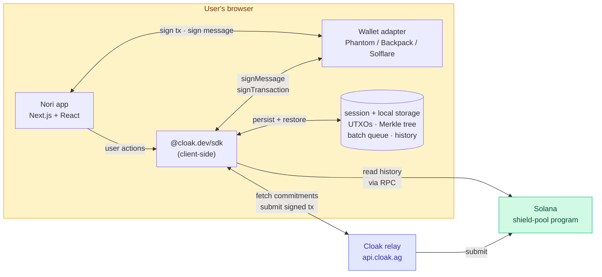
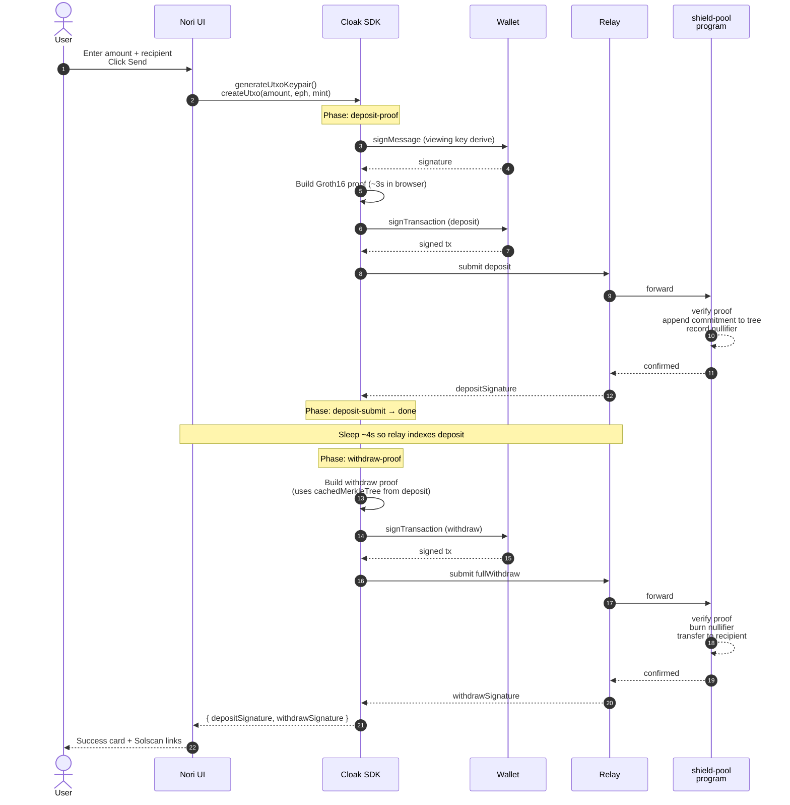
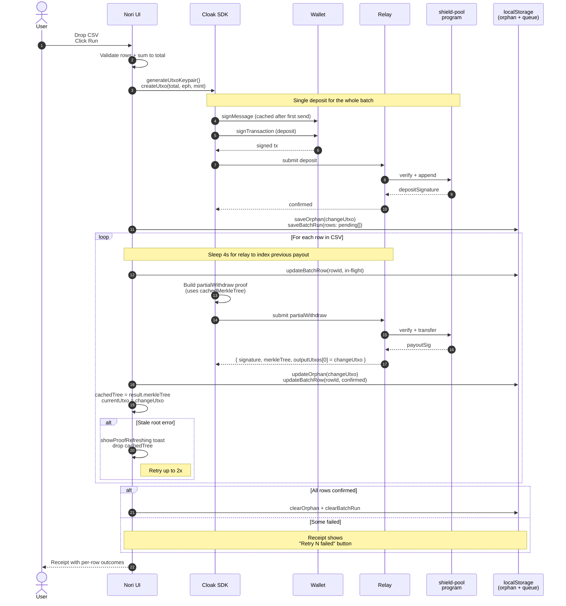
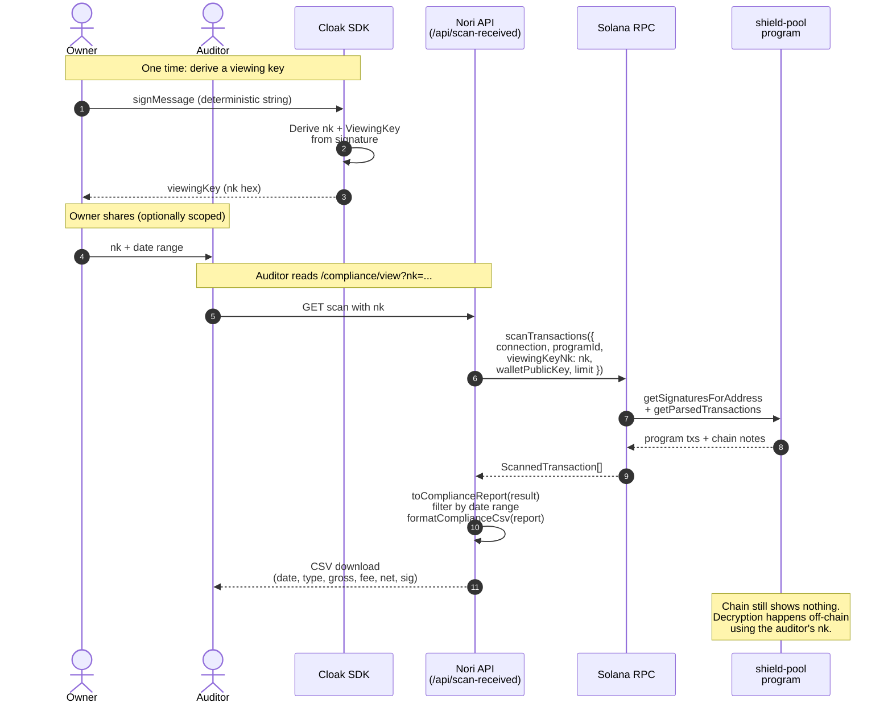
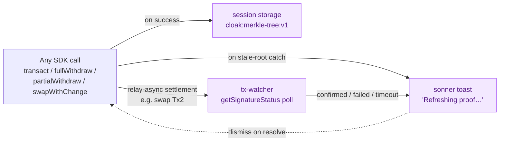

# Nori architecture and transaction flows

Five runtime surfaces, four data flows, one trust boundary.

This doc maps out where things live and how a user action turns into on-chain state. All diagrams are Mermaid; they render natively on GitHub and in Mintlify.

## System overview

The trust boundary lives at the browser. Spend keys, viewing keys, and the witnesses that go into a Groth16 proof never leave it. The relay sees signed transactions and public inputs; it cannot link payments to recipients or amounts. Solana sees the same thing the relay does.

The cache layer lets a follow-up send in the same tab skip the relay's commitments fetch (`cloak:merkle-tree:v1:*`), survive a reload mid-batch (`cloak:batch-queue:v1:*`), and recover orphaned change UTXOs (`cloak:orphan-utxo:v1:*`).

## Fast-send: single private payment

The pattern most consumer apps want: deposit + withdraw in one click, ephemeral keypair, one wallet popup. Source: `lib/cloak/fast-send-core.ts`.

Wallet popups: 2 (one signMessage, one signTransaction... actually `signTransaction` is called twice, once per leg, so 3 total prompts on first send; subsequent sends in the session memoize the signMessage so it drops to 2). The signMessage is what the SDK uses to derive the viewing key; Nori caches that signature in `lib/cloak/sign-message-cache.ts` so repeat sends don't re-prompt.

The deposit's returned `merkleTree` is passed as `cachedMerkleTree` to the withdraw call. The relay still re-validates the commitments against its own freshly-fetched leaves (SDK `dist/index.js:4699`), so the cache is a hint that skips the SDK's own fetch, not a bypass.

If the withdraw throws `RootNotFoundError` or `"is beyond next_index"`, the loop sleeps and retries up to 3 times, dropping the cached tree on each retry so the SDK refetches from chain state.

## Batch payroll: one deposit, many recipients

CSV in, one wallet signature, N payouts from the shielded pool. Source: `lib/cloak/use-batch-payroll.ts`.

Wallet popups: 1 (the deposit). Every payout signs with the ephemeral keypair the SDK already has, so there's no second wallet prompt no matter how many recipients are in the CSV.

The chained-change-UTXO pattern is what makes this work: each `partialWithdraw` produces a change note owned by the same ephemeral keypair, and that note becomes the input for the next row. Failure of any row leaves the change note in `cloak:orphan-utxo:v1:*` so the user can recover the residual balance later. The `cloak:batch-queue:v1:*` mirror tracks per-row state so the "Retry failed" button on the receipt knows exactly which rows still need work.

A page reload mid-batch sweeps any `in-flight` rows back to `pending` on hook mount (the `partialWithdraw` promise died with the page), so the queue is honest about what's still to send.

## Selective disclosure: viewing keys

Privacy is half. The other half is showing the right things to the right people. Source: `lib/cloak/viewing-keys.ts`, `lib/cloak/compliance-export.ts`, `app/api/scan-received/route.ts`.

The viewing key is the diversifier handed to `scanTransactions`. The SDK reads chain notes off-chain via RPC and decrypts only the ones that match. Revoking access is just rotating the diversifier and re-issuing; previously issued keys can no longer decrypt newly-emitted notes (Day 9 cryptographic revocation; the Day 7 UI flag is a tracking aid until that lands).

The chain transcript is unchanged. Auditors don't need on-chain access; they just need the viewing key bytes.

## Background reliability layer

A few pieces are not on the user's critical path but matter for keeping the product feeling solid.

- **Merkle tree session cache** keeps a follow-up op in the same tab from refetching the tree. Invalidated on any stale-root error.
- **Proof-refresh toast** surfaces the auto-retry that happens when the pool advanced past the root your proof committed to. Scoped per-flow id (`fast-send:<sig>`, `swap:<sig>`, `batch:<runId>:<rowId>`) so concurrent flows don't collide.
- **Tx watcher** polls `connection.getSignatureStatus` until target commitment for relay-managed signatures (notably the swap settlement Tx2). Fires success / error / timeout toasts independently of the page the user is on.

Sources: `lib/cloak/merkle-tree-cache.ts`, `lib/cloak/proof-refresh-toast.ts`, `lib/cloak/tx-watcher.ts`.

## Key constants

| Constant | Value | Where |
|---|---|---|
| Mainnet program ID | `zh1eLd6rSphLejbFfJEneUwzHRfMKxgzrgkfwA6qRkW` | `lib/cloak/config.ts` |
| Devnet program ID | `Zc1kHfp4rajSMeASFDwFFgkHRjv7dFQuLheJoQus27h` | `lib/cloak/config.ts` |
| Mainnet relay | `https://api.cloak.ag` | `lib/cloak/config.ts` |
| Devnet relay | `https://api.devnet.cloak.ag` | `lib/cloak/config.ts` |
| Merkle tree height | 32 | SDK `MERKLE_TREE_HEIGHT` |
| Root history depth | 100 entries (ring buffer) | shield-pool program |
| Fixed fee | 0.005 SOL | SDK `FIXED_FEE_LAMPORTS` |
| Variable fee | 0.30% of gross | SDK `VARIABLE_FEE_RATE` |
| Minimum deposit | 10,000,000 lamports | SDK `MIN_DEPOSIT_LAMPORTS` |
| Relay-settle delay between rows | 4,000 ms | `RELAY_SETTLE_DELAY_MS` in `use-batch-payroll.ts` |
| Stale-root retry budget | 3 attempts | `WITHDRAW_MAX_ATTEMPTS`, `STALE_RETRY_MAX` |
| Merkle cache TTL | 30 minutes | `MAX_AGE_MS` in `merkle-tree-cache.ts` |

## Further reading

- [INTEGRATION.md](./INTEGRATION.md): drop the SDK into your own Next 16 app
- [Cloak protocol docs](https://docs.cloak.ag): UTXO model, circuit signals, on-chain layout
- Live mainnet app: [usenori.xyz](https://usenori.xyz)
